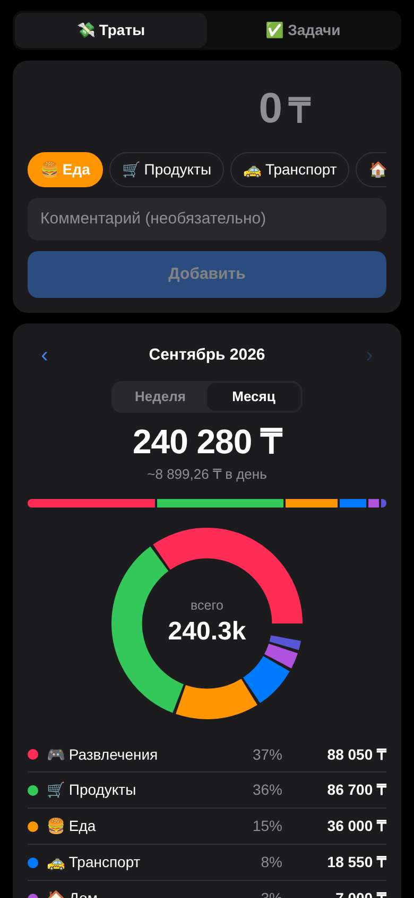
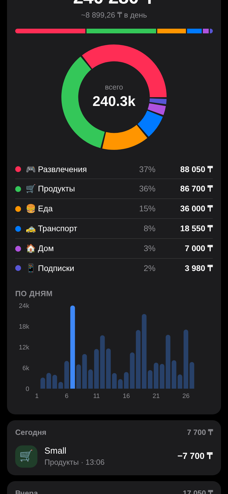
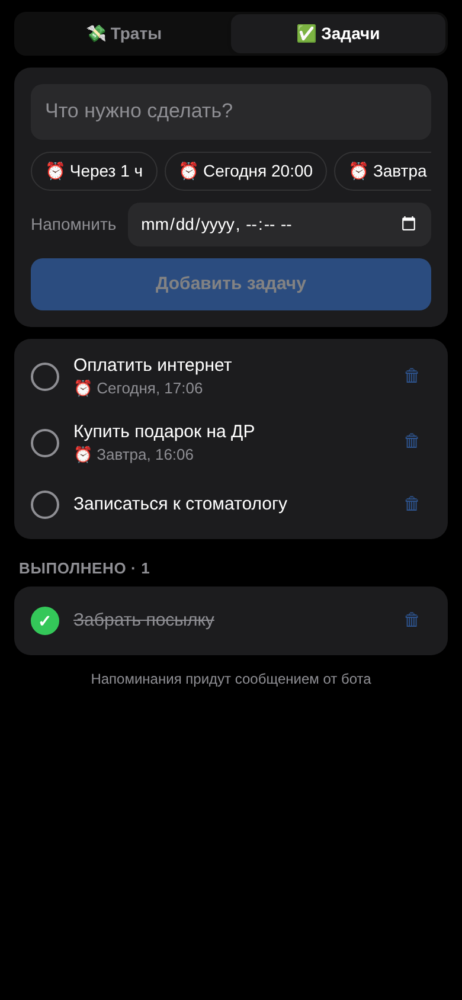

# Pocket — траты и задачи в Telegram Mini App

Личный финансовый трекер и to-do в одном окне Telegram. Трату можно записать одним сообщением боту (`500 кофе`) или в Mini App. Там же категории, графики и задачи с напоминаниями.

<p>
  
  
  
</p>

## Возможности

**Траты**
- Быстрый ввод в Mini App: сумма → категория (чипы) → нативная кнопка Telegram «Добавить».
- Быстрый ввод в чате: `500 кофе`, `такси 1.5к`, `2 500 продукты`, `обед 3200 тг`. Категория определяется по ключевым словам, у ответа есть кнопка «Отменить».
- Свои категории с эмодзи и цветом, 10 категорий по умолчанию.
- Период неделя/месяц, листание назад, сравнение с прошлым периодом, среднее в день.
- **Компактное окно** показывает ввод, итог и полоску долей категорий. **Развёрнутое окно** добавляет донат по категориям и график по дням (отслеживается `viewportChanged`).
- `/today`, `/week`, `/month` — сводка прямо в чате.

**Задачи**
- Пресеты напоминаний («Через 1 ч», «Завтра 9:00» и т.д.) или своя дата и время.
- Бот присылает напоминание с кнопками ✅ Готово / ⏳ 15 мин / ⏳ 1 ч.
- `/task Позвонить маме завтра 10:00` и `/tasks` работают из чата.

**Прочее**
- Данные у каждого пользователя свои. Доступ ограничивается списком `ALLOWED_USERS`.
- Авторизация через проверку подписи Telegram `initData` (HMAC-SHA256), без паролей.
- Цвета берутся из темы Telegram, поэтому светлая и тёмная тема подхватываются сами. При нажатиях есть haptic feedback.
- Кнопка «Добавить на главный экран» (Bot API 8.0+).

## Стек

| | |
|---|---|
| Бот | Python 3.12, **aiogram 3** (long polling) |
| API | **FastAPI**, SQLAlchemy 2 (async), Pydantic 2 |
| БД | SQLite по умолчанию, PostgreSQL через `DATABASE_URL` |
| Mini App | **React 18 + TypeScript + Vite**, Recharts, Telegram WebApp SDK |
| Деплой | Docker (multi-stage), docker-compose, Cloudflare Tunnel |
| Тесты | pytest: подпись initData, изоляция данных пользователей, статистика, напоминания, парсер |

```
Telegram ──► aiogram (polling) ─┐
                                ├─► SQLAlchemy ─► SQLite / Postgres
Mini App ──► FastAPI /api/* ────┘
   ▲             │
   └─ static ◄───┘  (один контейнер: API + бот + фон. задача напоминаний + собранный React)
```

## Быстрый старт

### 1. Создать бота
1. [@BotFather](https://t.me/BotFather) → `/newbot` → получить токен.
2. Узнать свой и её Telegram ID через [@userinfobot](https://t.me/userinfobot).
3. `cp .env.example .env` и заполнить `BOT_TOKEN` и `ALLOWED_USERS`.

### 2. Запустить на своём компе (бесплатно, Docker)

```bash
docker compose --profile tunnel up -d --build
docker compose logs -f app      # ждём строку "tunnel url: https://....trycloudflare.com"
```

Cloudflare Tunnel выдаёт бесплатный HTTPS-адрес без регистрации. Бот сам его узнаёт и прописывает в кнопку меню. Открываешь бота → `/start` → кнопка **Pocket**.

> Если адрес туннеля поменяется после перезапуска, кнопка меню обновится сама. Кнопки «Открыть» в старых сообщениях будут вести на старый адрес, поэтому пользуйся кнопкой меню.

### 3. Разработка без Docker

```bash
# backend
cd backend
python -m venv .venv && source .venv/bin/activate   # Windows: .venv\Scripts\activate
pip install -r requirements.txt
DEV_USER_ID=1 RUN_BOT=false uvicorn app.main:app --reload     # API без Telegram

# frontend (в другом терминале)
cd frontend && npm install && npm run dev    # http://localhost:5173, /api проксируется на :8000
```

`DEV_USER_ID` пускает в API без Telegram, чтобы открывать приложение в обычном браузере. **Не включай его в проде.**

Тесты: `cd backend && pip install pytest httpx && pytest -q`

## Хостинг

| Вариант | Цена | Напоминания 24/7 | Комментарий |
|---|---|---|---|
| **Render + Neon + UptimeRobot** | 0, без карты | ✅ | Используется сейчас. Описан ниже |
| Свой комп + Cloudflare Tunnel | 0 | только пока комп включён | Самый простой вариант, описан выше |
| Бесплатная VM (например, Oracle Cloud Always Free) | 0 | ✅ | `git clone` → `docker compose --profile tunnel up -d`. Для верификации нужна карта |
| Дешёвый VPS + свой домен | ~$3–5/мес | ✅ | Без профиля `tunnel`, указать `WEBAPP_URL=https://...`, перед приложением поставить nginx/Caddy с HTTPS |
| Бесплатные PaaS (Render и т.п.) | 0 | ❌ | На бесплатных тарифах сервис засыпает без трафика, поэтому polling и напоминания останавливаются. Для этого бота не подходит |

### Бесплатно 24/7: Render + Neon

1. **Neon** — создай проект в регионе *AWS Europe Central 1 (Frankfurt)* и скопируй Connection string (`postgresql://...?sslmode=require`), её можно вставлять как есть. В *Compute* поставь максимум 0.25 CU.
2. **Render** — *New → Blueprint*, выбери этот репозиторий: `render.yaml` создаст сервис `pocket` (Docker, free, Frankfurt). Заполни `BOT_TOKEN`, `ALLOWED_USERS`, `DATABASE_URL`. Адрес Mini App берётся из `RENDER_EXTERNAL_URL` сам.
3. **UptimeRobot** — HTTP-монитор на `https://<сервис>.onrender.com/health` раз в 5 минут, иначе бесплатный Render засыпает через 15 минут без трафика и бот перестаёт отвечать.

Лимиты: на Render free хватает часов ровно на один сервис 24/7. На Neon free 100 CU-часов в месяц (400 ч при 0.25 CU), а база засыпает через 5 минут без запросов. Поэтому цикл напоминаний не опрашивает БД по таймеру, а спит до ближайшего напоминания, и к Postgres приложение подключается без пула соединений.

## Открытие «одной кнопкой» с телефона

Сначала в @BotFather → *Bot Settings → Configure Mini App* включи Main Mini App и укажи URL. После этого приложение открывается ссылкой `https://t.me/<бот>?startapp` (а `?startapp=tasks` сразу открывает вкладку задач).

- **iPhone.** Приложение «Команды» → новая команда «Открыть URL» с этой ссылкой. Дальше *Настройки → Универсальный доступ → Касание → Касание задней панели → Двойное касание* → выбрать команду. Двойной тап по задней крышке открывает Pocket. На 15 Pro и новее ту же команду можно повесить на кнопку «Действие».
- **Android.** Кнопка «📌 Добавить на главный экран» внутри приложения создаёт ярлык. Двойное нажатие кнопки питания на большинстве прошивок открывает камеру. На Samsung (*Доп. функции → Боковая кнопка*) туда можно назначить запуск приложения, но только целого приложения, а не ссылки.

## Структура

```
backend/app/
  main.py       FastAPI, запуск бота, фоновые напоминания, раздача фронта
  api.py        REST: /api/me, categories, expenses, stats, tasks
  auth.py       проверка Telegram initData
  bot.py        команды, быстрый ввод трат, callback-кнопки, отправка напоминаний
  parser.py     разбор «500 кофе» и угадывание категории
  models.py     User, Category, Expense, Task
frontend/src/
  App.tsx       вкладки
  Expenses.tsx  ввод, итоги, история
  Charts.tsx    донат, бары по дням, полоска категорий
  Tasks.tsx     задачи и напоминания
  tg.ts         обёртка Telegram WebApp (MainButton, haptics, expand)
```

## Идеи для развития
- Общий бюджет на двоих (пространства с приглашением по ссылке)
- Лимиты по категориям и предупреждения в боте
- Регулярные траты и задачи (подписки, коммуналка)
- Экспорт в CSV/Excel, миграции Alembic, CI на GitHub Actions
